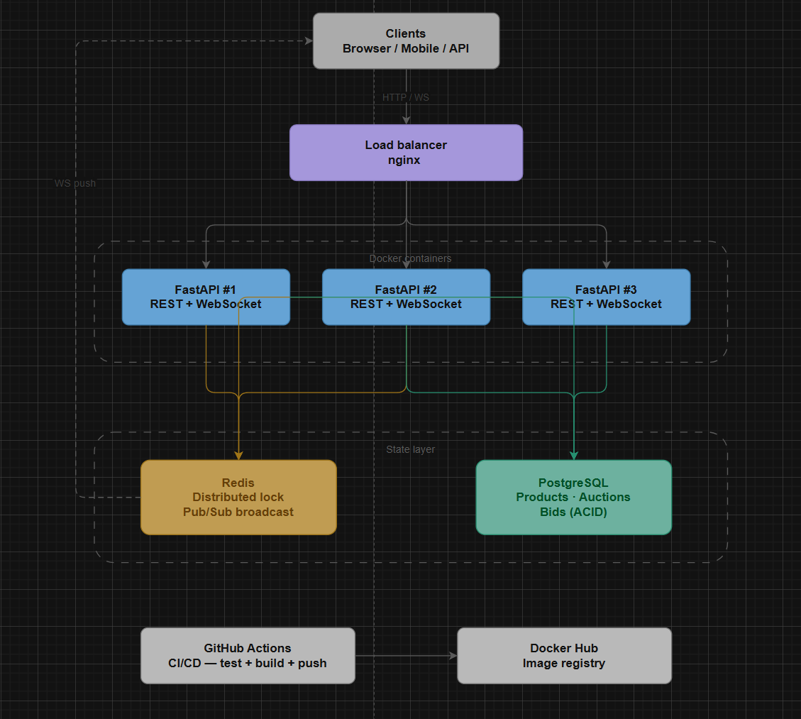
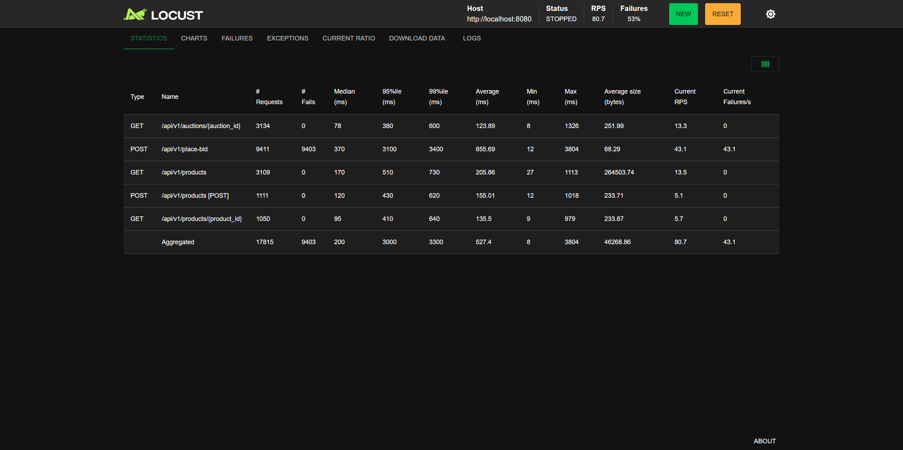

# Auction Engine

A high-frequency auction platform built with FastAPI, PostgreSQL, Redis, and Clean Architecture. Supports real-time bid updates via WebSockets, distributed locking for concurrency, and a live React dashboard.

## Tech Stack

| Layer                  | Technology              | Purpose                                     |
| ---------------------- | ----------------------- | ------------------------------------------- |
| API                    | FastAPI + Python 3.12   | REST endpoints + WebSocket                  |
| Database               | PostgreSQL 16           | ACID transactions, bid persistence          |
| Cache / Lock / Pub/Sub | Redis 7                 | Distributed locks, real-time broadcast      |
| Architecture           | Clean Architecture      | Strict layer separation, testable domain    |
| Reverse Proxy          | nginx                   | Load balancer, static file serving          |
| Containers             | Docker + Docker Compose | Full stack orchestration                    |
| CI/CD                  | GitHub Actions          | Automated test + build + push to Docker Hub |
| Stress Test            | Locust                  | 100+ concurrent users simulation            |
| Frontend               | React 18 + Vite         | Live auction dashboard                      |

## Architecture



The system follows Clean Architecture with strict unidirectional dependencies:

```
domain → application → infrastructure ← api
```

No layer imports from a layer above it. The domain has zero external dependencies — it can be tested without a database or Redis.

- **domain/** — Pure Python dataclasses (`Product`, `Auction`, `Bid`), exceptions, and abstract interfaces (`IBidRepository`, `ILockService`, `IBroadcastService`)
- **application/** — Use cases (`PlaceBidUseCase`, `CreateAuctionUseCase`, etc.) that depend only on domain interfaces
- **infrastructure/** — Concrete implementations: SQLAlchemy repositories, Redis lock service, WebSocket broadcaster
- **api/** — FastAPI routers, Pydantic schemas, dependency injection wiring

## Prerequisites

- [Docker Desktop](https://www.docker.com/products/docker-desktop/) — required for the full stack
- [Python 3.12](https://python.org/downloads) — required only for running local scripts (stress tests, race condition PoC)

## Quick Start

```bash
git clone https://github.com/nramirez-dev/auction-engine.git
cd auction-engine
cp .env.example .env
docker compose up --build
```

| URL                              | Description            |
| -------------------------------- | ---------------------- |
| http://localhost:8080/docs       | Swagger UI             |
| http://localhost:8080/dashboard/ | Live auction dashboard |

> ⚠️ Ensure port **8080** is available before starting the stack.  
> It is used by the Nginx reverse proxy as the single entry point to the system.

## Horizontal Scaling

The API layer supports horizontal scaling behind the Nginx reverse proxy.

By default, running `docker compose up` starts a single FastAPI instance. For higher throughput and better simulation of a production environment, multiple API replicas can be launched using Docker Compose scaling:

```bash
docker compose up --scale api=3
```

## API Endpoints

| Method   | Endpoint                | Description                          |
| -------- | ----------------------- | ------------------------------------ |
| `POST`   | `/api/v1/products`      | Create a product                     |
| `GET`    | `/api/v1/products`      | List all products                    |
| `GET`    | `/api/v1/products/{id}` | Get a product                        |
| `DELETE` | `/api/v1/products/{id}` | Delete a product (owner only)        |
| `POST`   | `/api/v1/auctions`      | Start an auction for a product       |
| `GET`    | `/api/v1/auctions/{id}` | Get auction status and current price |
| `POST`   | `/api/v1/place-bid`     | Place a bid                          |
| `GET`    | `/api/v1/ws-ticket`     | Get a one-time WebSocket auth ticket |
| `WS`     | `/ws/auction/{id}`      | Real-time bid stream                 |

## Testing the Full Flow (Swagger UI)

Open **http://localhost:8080/docs** and follow these steps in order:

---

**Step 1 — Create a product** `POST /api/v1/products`

```json
{
  "owner_id": "550e8400-e29b-41d4-a716-446655440000",
  "title": "MacBook Pro M3",
  "description": "Laptop in perfect condition",
  "starting_price": 1000.0
}
```

> Save the `id` from the response — this is your `product_id`.

---

**Step 2 — Start an auction** `POST /api/v1/auctions`

```json
{
  "product_id": "<product_id from step 1>",
  "owner_id": "550e8400-e29b-41d4-a716-446655440000"
}
```

> Save the `id` from the response — this is your `auction_id`.

---

**Step 3 — Get a WebSocket ticket** `GET /api/v1/ws-ticket`

```
?user_id=660e8400-e29b-41d4-a716-446655440001
```

> Save the `ticket` from the response — it expires in 30 seconds.

---

**Step 4 — Connect to the real-time stream**

Open [WebSocket King](https://websocketking.com) and connect to:

```
ws://localhost:8080/ws/auction/<auction_id>?ticket=<ticket from step 3>
```

> Keep this tab open — you will see bids arrive in real time.

---

**Step 5 — Place a bid** `POST /api/v1/place-bid`

Add the `Idempotency-Key` header with any unique string (e.g. `my-bid-001`), then send:

```json
{
  "auction_id": "<auction_id from step 2>",
  "user_id": "660e8400-e29b-41d4-a716-446655440001",
  "amount": 1200.0
}
```

> The WebSocket tab from step 4 will receive the new bid instantly.

---

**Step 6 — Verify the price updated** `GET /api/v1/auctions/{auction_id}`

The response should show `"current_price": "1200.00"` and `"status": "ACTIVE"`.

---

> Prefer a visual interface? Use the **Live Dashboard** at http://localhost:8080/dashboard/ — it covers the full flow without touching Swagger.

## Consistency Logic

When `POST /api/v1/place-bid` is called, the system follows this sequence:

1. **Idempotency check** — query `bids.idempotency_key` before acquiring any lock. If found, return `409` immediately.
2. **Acquire distributed lock** — `redis.lock("lock:auction:{id}", timeout=5s, blocking_timeout=3s)`. Only one request proceeds at a time per auction across all API instances.
3. **Validate under lock** — fetch auction, check `status == ACTIVE`, check `amount > current_price`. Both checks happen inside the lock so no concurrent request can invalidate them between read and write.
4. **Write to PostgreSQL** — insert the bid and update `auction.current_price` in a single transaction.
5. **Publish to Redis Pub/Sub** — broadcast the accepted bid to all subscriber instances.
6. **Release lock** — the `finally` block releases the lock even if any step above fails.

**Failure scenarios:**

| Failure                        | Outcome                                                                                                                                                                                                                                                                                                                                                                                                                                          |
| ------------------------------ | ------------------------------------------------------------------------------------------------------------------------------------------------------------------------------------------------------------------------------------------------------------------------------------------------------------------------------------------------------------------------------------------------------------------------------------------------ |
| PostgreSQL write fails         | Exception raised before broadcast. No partial state. Lock released.                                                                                                                                                                                                                                                                                                                                                                              |
| Redis lock unavailable         | Request rejected with `503` before touching the database. The client should retry — the condition is temporary (another bid is in-flight).                                                                                                                                                                                                                                                                                                       |
| Broadcast fails after DB write | **Broadcast is best-effort.** The bid is already committed to PostgreSQL (source of truth). The use case swallows the broadcast error, logs a warning, and still returns `201` to the client. Connected WebSocket clients will not receive the real-time push for that bid, but the state is fully consistent. Any client can verify the current price at any time via `GET /api/v1/auctions/{id}`. The idempotency key prevents unsafe retries. |
| WebSocket client disconnects   | `WebSocketDisconnect` caught silently. Pub/Sub subscription cleaned up. No impact on bid flow.                                                                                                                                                                                                                                                                                                                                                   |

## Environment Management

Secrets are never committed. The `.env` file is gitignored — only `.env.example` with placeholder values is tracked. In CI, all credentials are GitHub Actions secrets. Docker containers receive values via `env_file`.

```bash
cp .env.example .env
# Edit .env with your local values
```

## Bonus Features

| Bonus                         | Implementation                                                                                                                                                                                                                          |
| ----------------------------- | --------------------------------------------------------------------------------------------------------------------------------------------------------------------------------------------------------------------------------------- |
| **A — Idempotency Keys**      | `Idempotency-Key` header on `POST /place-bid`. Checked against a unique DB constraint before acquiring the lock. Returns `409` on replay.                                                                                               |
| **B — Live Dashboard**        | React 18 + Vite app at `/dashboard/`. Three tabs: Live Auction (real-time WebSocket feed), Create Auction, My Products. Built automatically by Docker on startup.                                                                       |
| **C — Race Condition PoC**    | `tests/security/race_condition.py` — three scenarios proving the distributed lock works. Run from your machine against the live stack.                                                                                                  |
| **D — WebSocket Ticket Auth** | `GET /api/v1/ws-ticket?user_id={id}` issues a 30-second one-time token stored in Redis. The WebSocket endpoint uses `GETDEL` (atomic get + delete) to validate and consume the ticket in a single operation, preventing replay attacks. |
| **E — Stress Test**           | Locust test simulating 100+ concurrent users across bid, auction, and product endpoints.                                                                                                                                                |

## Stress Test Results



Run against **100 concurrent users**, spawn rate **10**, targeting `http://localhost:8080`:

| Endpoint                            | Requests   | Failures  | Median (ms) | 95th % (ms) | 99th % (ms) | Avg (ms)  | RPS      |
| ----------------------------------- | ---------- | --------- | ----------- | ----------- | ----------- | --------- | -------- |
| `GET /api/v1/auctions/{auction_id}` | 3,134      | 0         | 78          | 380         | 600         | 123.9     | 13.3     |
| `POST /api/v1/place-bid`            | 9,411      | 9,403\*   | 370         | 3,100       | 3,400       | 855.7     | 43.1     |
| `GET /api/v1/products`              | 3,109      | 0         | 170         | 510         | 730         | 205.9     | 13.5     |
| `POST /api/v1/products`             | 1,111      | 0         | 120         | 430         | 620         | 155.0     | 5.1      |
| `GET /api/v1/products/{product_id}` | 1,050      | 0         | 95          | 410         | 640         | 135.5     | 5.7      |
| **Aggregated**                      | **17,815** | **9,403** | **200**     | **3,000**   | **3,300**   | **527.4** | **80.7** |

\*_The 9,403 failures on `place-bid` are expected behavior under high concurrency._

When multiple users attempt to place bids simultaneously, the system enforces
consistency using distributed locking and bid validation. Bids that arrive
after a higher bid has already been accepted are correctly rejected.

All other endpoints show **0 failures**, indicating the API remains stable
under load while protecting auction integrity.

**Race condition test results** (`tests/security/race_condition.py`):

| Scenario            | Action                              | Expected               | Result                     |
| ------------------- | ----------------------------------- | ---------------------- | -------------------------- |
| Concurrent lock     | 10 simultaneous bids at same amount | 1 accepted, 9 rejected | ✅ `{201: 1, 422: 9}`      |
| Sequential overbids | 20 bids each +$1 higher             | All 20 accepted        | ✅ `{201: 20}`             |
| Idempotency replay  | Same bid sent twice, same key       | 201 then 409           | ✅ `first=201, second=409` |

## Local Scripts Setup (venv)

The virtual environment is only needed to run local scripts — the full application runs entirely inside Docker.

**Create and activate the venv inside the project root:**

```bash
# macOS / Linux
python3 -m venv .venv
source .venv/bin/activate
pip install -r requirements.txt

# Windows (PowerShell)
python -m venv .venv
.\.venv\Scripts\Activate.ps1
pip install -r requirements.txt
```

> Once the venv is active, the commands below work as-is — no path prefix needed.

**Running the stress test** (with venv active):

```bash
locust -f tests/stress/locustfile.py --host=http://localhost:8080
```

Open http://localhost:8089 → Users: 100, Spawn rate: 10

> Runs from the host machine against the nginx entry point — this accurately simulates external traffic hitting the full stack, including the load balancer.

**Running the race condition script** (with venv active):

```bash
python tests/security/race_condition.py
```

> Runs from the host machine against the nginx entry point — this accurately simulates external traffic hitting the full stack, including the load balancer.

## CI/CD Pipeline

The project includes a full CI/CD pipeline powered by GitHub Actions.

**CI workflow**

On every push and pull request:

1. Start PostgreSQL and Redis containers
2. Build the API container
3. Run database migrations
4. Execute the full test suite with `pytest`

This ensures the application always builds and passes tests before deployment.

**Deployment workflow**

When changes are pushed to the `main` branch:

1. Build the Docker image
2. Push the image to **GitHub Container Registry (GHCR)**
3. Trigger a redeploy on **Railway** via the Railway GraphQL API

This guarantees that every deployed version originates from a tested container image.

See `.github/workflows/deploy.yml` for the full pipeline definition.

## Tool Recommendations

| Tool                     | Purpose                                                                                                                   |
| ------------------------ | ------------------------------------------------------------------------------------------------------------------------- |
| **SonarCloud**           | Static code analysis — detects bugs, code smells, and security hotspots on every push with quality gate enforcement       |
| **GKE**                  | Managed Kubernetes engine — handles replica management, auto-scaling, and rolling deployments natively on Google Cloud    |
| **Redis Sentinel**       | Redis high availability — eliminates the single point of failure in the state layer                                       |
| **Prometheus + Grafana** | Metrics collection and real-time dashboards — monitors endpoint latency and bid processing performance across the cluster |
| **Azure Key Vault**      | Production-grade secret management — native integration with Azure deployments, supports automatic secret rotation        |
